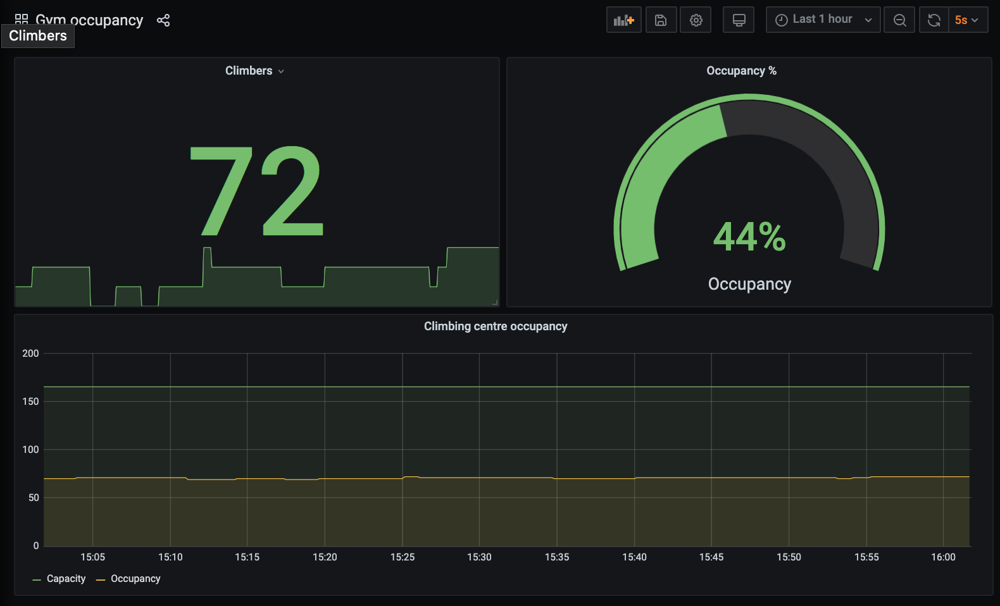

# Gym occupancy 

My [local rock climbing gym](https://thereach.org.uk/) provides real-time occupancy numbers - yay! This repo attempts to capture this info over time, to find the quietest times to visit.

## Quickstart

1.  Pull the repo and build the Docker image with `docker-compose build`
2.  Start services with `docker-compose up -d`
3.  Head to [localhost:8000](http://localhost:8000) for the Graphite app (for finding metrics) and [localhost:3000](http://localhost:3000) for the Grafana app (for visualising metrics).
    1.  A dashboard will already have been configured in Grafana - head to Dashboards, Manage, and then "Gym occupancy").
    2.  If you're not seeing data, check `docker-compose logs -f populator`.



## Tech details, or how to adapt this to your needs

I'm using StatsD for simple metric collection, Graphite for storage and Grafana for visualisations. This means that tracking a different website is as simple as writing a scraping script (like fetch.py) and printing StatsD metrics to stdout, piped to `netcat`. For example, this is how I use fetch.py (where `graphite:8125` is the network location of the `graphite` docker-compose container):

```
while true; do
    poetry run python fetch.py 2> /dev/null | nc -u -w1 graphite 8125;
    sleep 60;
done
```

If you're lucky, your target website will expose their occupancy data as a JSON endpoint - it's a fairly trivial matter to request that (`response = requests.get(url)`), parse the JSON (`response.json`) and convert that into some StatsD gauge metric lines (`print(f"gym.MYGYM.occupancy:{json['visitors']}|g")`).

The site/service I'm scraping embeds their numbers into inline JavaScript on the page. I've employed two tools to extract these:

1.  Parse the `<script>` tag contents from the page: I'm using [`html.parser`][htmlparser], which can be a bit tricky to understand if you haven't had the _joy_ of using a streaming parser before (e.g. SAX in XML-parsing land). Essentially I am listening for three 'events' as the HTML stream is parsed: start-tag (e.g. `<script>`), end-tag (`</script>`) and data, which is when the parser has finished reading everything inside the `<script></script>` tags. `ScriptExtractorParser` hooks into these events to collect a list of strings, which will be the contents of every `<script></script>` tag on the page (except the empty ones).
2.  Parse the JavaScript source to extract the numbers. The simple method for this is regular-expressions, though I've found these to be very brittle in the past, requiring lots of effort to keep them working. Instead, I've opted for a Python package called [SlimIt][slimit] - a JavaScript minifier, that contains a nice JavaScript parser. This package lexes the JS source into tokens (letter, number, semicolon, etc.), and nodes (variable-declaration, string, array, null, etc.). We can then tap into this by visiting each node in the JS source to find our variable declaration `var data = {}` and scrape out our fields. It's more complicated, but if the occupancy provider decides to update their code later on, there's a smaller chance it will break our scraper (and it should be easier to fix).

Finally I'm emitting these numbers as StatsD Gauge metrics: occupancy, capacity (probably static, but may evolve as the Covid situation progresses) and a percentage of occupancy (as Grafana doesn't seem to be able to calculate two metrics easily).

I've configured Grafana to boot up with a pre-configured Graphite data-source and a dashboard. If you make changes to the dashboard, you can persist these by going to Dashboard Settings > JSON Model and saving the JSON to provisioning/grafana/dashboards/your-dashboard.json.

If you're thinking about deploying this somewhere, Grafana is configured to allow anonymous access, with automatically granted administrator rights. This is fine for me, because it quietly runs on my laptop. You should look into configuring Grafana properly :-)

[MIT Licensed](./LICENSE)

[htmlparser]: https://docs.python.org/3/library/html.parser.html
[slimit]: https://pypi.org/project/slimit/
